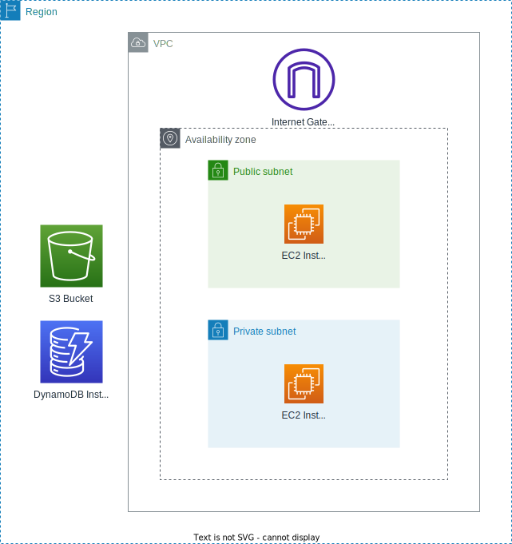

# Simple AWS 3-tier application server

In this sample project,, specified resources below are provisioned :

* All resources are architectured in a single availablity zone.
* A VPC consist of 2 public and private subnets and an IGW for public servers to access Internet
* An EC2 instance with public IP address to serve as frond end.
* A S3 bucket to store various objects.
* A DynamoDB instance to manage NoSQL database.

---

In this project modular approach has been applied. In [main.tf](./main.tf) file four modules are called to include components.

AWS credentials and some other information are evaluated in "terraform.tfvars" file. A [sample variable file](./terraform.tfvars.sample) is included in this repository.

---

Project diagram

